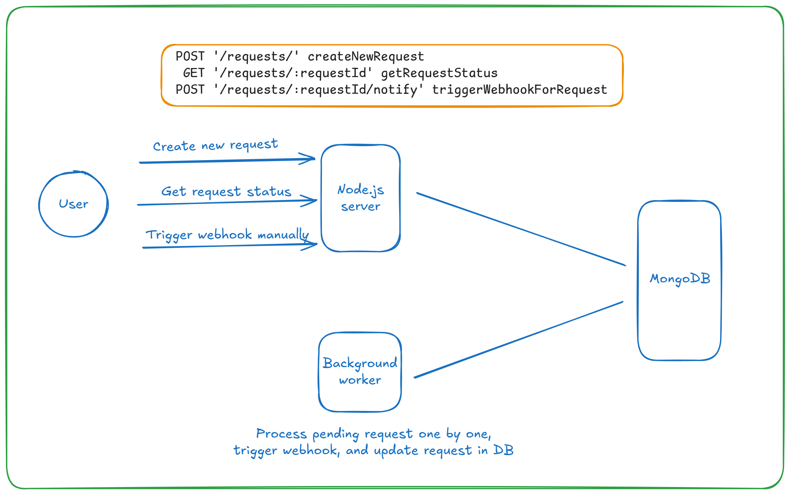

# Image Processing System

## Overview
This project is a backend system that processes image data from CSV files asynchronously. The system:  
✅ Accepts a CSV file containing product names and image URLs.  
✅ Validates and stores the data in **MongoDB**.  
✅ Processes images by compressing them **by 50%**.  
✅ Saves processed images and their URLs.  
✅ Provides an **API to check processing status**.  
✅ Supports **webhook notifications** when processing is complete.  

---

## Tech Stack
**Backend:** Node.js, Express  
**Database:** MongoDB  
**Image Processing:** sharp  
**File Handling:** multer  
**Make HTTP Requests:** axios  
**CSV Parsing:** csv-parser  

---

## Setup
**Install Dependencies** npm i  
**Start Server** npm run start  
**Start Worker** npm run worker  

---

## Visual Diagram

